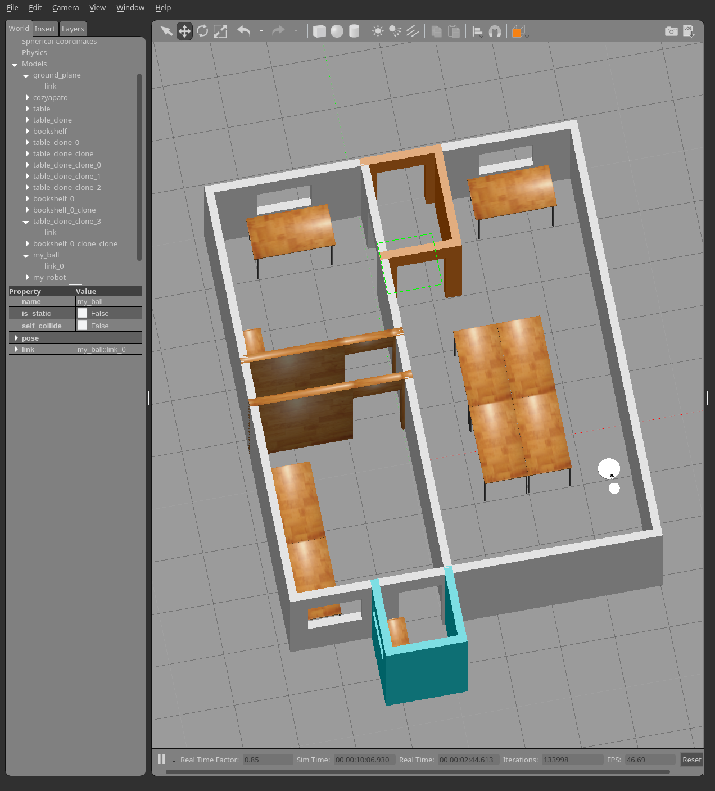

# Go Chase It!

Ball chasing robot for written for [Udacity Robotics Software Engineer Nanodegree](https://www.udacity.com/course/robotics-software-engineer--nd209).

Move a ball by hand in a simulated world, and my robot will chase it, as long as it can see it. The world is based loosely on my living arrangement at the time.

## Requirements

- [ROS Kinetic](http://wiki.ros.org/kinetic/Installation)
- [Gazebo simulator](http://gazebosim.org/) (you would have it if you installed ROS via ros-desktop-full)

## Usage

- Copy both gci_my_robot and gci_ball_chaser packages into your catkin workspace
- Build them via catkin_make
- Launch these:
    - gci_my_robot world.launch
    - gci_ball_chaser.launch
- Move the ball (initially outside the building) into the robot's view (there is a camera under the black lidar)

You will see something like this:

